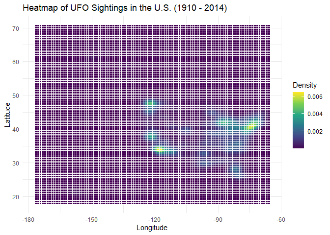
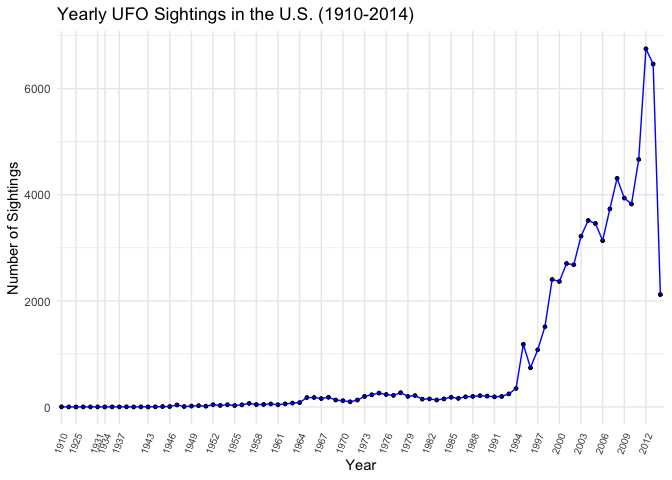
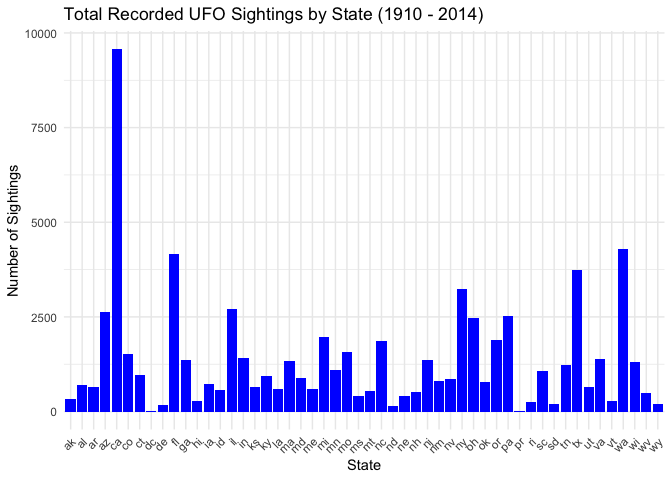
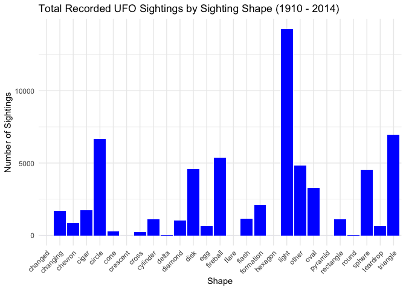

## Installing & loading any required packages:

```r
#install.packages("paletteer")
```


```r
library("tidyverse")
```

```
## ── Attaching core tidyverse packages ──────────────────────── tidyverse 2.0.0 ──
## ✔ dplyr     1.1.3     ✔ readr     2.1.4
## ✔ forcats   1.0.0     ✔ stringr   1.5.0
## ✔ ggplot2   3.4.3     ✔ tibble    3.2.1
## ✔ lubridate 1.9.2     ✔ tidyr     1.3.0
## ✔ purrr     1.0.2     
## ── Conflicts ────────────────────────────────────────── tidyverse_conflicts() ──
## ✖ dplyr::filter() masks stats::filter()
## ✖ dplyr::lag()    masks stats::lag()
## ℹ Use the conflicted package (<http://conflicted.r-lib.org/>) to force all conflicts to become errors
```

```r
library("naniar")
library("janitor")
```

```
## 
## Attaching package: 'janitor'
## 
## The following objects are masked from 'package:stats':
## 
##     chisq.test, fisher.test
```

```r
library("ggmap")
```

```
## ℹ Google's Terms of Service: <https://mapsplatform.google.com>
##   Stadia Maps' Terms of Service: <https://stadiamaps.com/terms-of-service/>
##   OpenStreetMap's Tile Usage Policy: <https://operations.osmfoundation.org/policies/tiles/>
## ℹ Please cite ggmap if you use it! Use `citation("ggmap")` for details.
```

```r
library("dplyr")
```

## Pre-processing the data set

### Importing the data and assigning "NA" to any missing values

```r
ufo <- readr::read_csv("ufo_data/complete.csv", na = c("", "unkown")) %>% clean_names
```

```
## Warning: One or more parsing issues, call `problems()` on your data frame for details,
## e.g.:
##   dat <- vroom(...)
##   problems(dat)
```

```
## Rows: 88875 Columns: 11
## ── Column specification ────────────────────────────────────────────────────────
## Delimiter: ","
## chr (10): datetime, city, state, country, shape, duration (hours/min), comme...
## dbl  (1): duration (seconds)
## 
## ℹ Use `spec()` to retrieve the full column specification for this data.
## ℹ Specify the column types or set `show_col_types = FALSE` to quiet this message.
```

### Inspecting its basic structure

```r
glimpse(ufo)
```

```
## Rows: 88,875
## Columns: 11
## $ datetime           <chr> "10/10/1949 20:30", "10/10/1949 21:00", "10/10/1955…
## $ city               <chr> "san marcos", "lackland afb", "chester (uk/england)…
## $ state              <chr> "tx", "tx", NA, "tx", "hi", "tn", NA, "ct", "al", "…
## $ country            <chr> "us", NA, "gb", "us", "us", "us", "gb", "us", "us",…
## $ shape              <chr> "cylinder", "light", "circle", "circle", "light", "…
## $ duration_seconds   <dbl> 2700, 7200, 20, 20, 900, 300, 180, 1200, 180, 120, …
## $ duration_hours_min <chr> "45 minutes", "1-2 hrs", "20 seconds", "1/2 hour", …
## $ comments           <chr> "This event took place in early fall around 1949-50…
## $ date_posted        <chr> "4/27/2004", "12/16/2005", "1/21/2008", "1/17/2004"…
## $ latitude           <chr> "29.8830556", "29.38421", "53.2", "28.9783333", "21…
## $ longitude          <chr> "-97.9411111", "-98.581082", "-2.916667", "-96.6458…
```


```r
summary(ufo)
```

```
##    datetime             city              state             country         
##  Length:88875       Length:88875       Length:88875       Length:88875      
##  Class :character   Class :character   Class :character   Class :character  
##  Mode  :character   Mode  :character   Mode  :character   Mode  :character  
##                                                                             
##                                                                             
##                                                                             
##                                                                             
##     shape           duration_seconds   duration_hours_min   comments        
##  Length:88875       Min.   :       0   Length:88875       Length:88875      
##  Class :character   1st Qu.:      15   Class :character   Class :character  
##  Mode  :character   Median :     120   Mode  :character   Mode  :character  
##                     Mean   :    8373                                        
##                     3rd Qu.:     600                                        
##                     Max.   :97836000                                        
##                     NA's   :5                                               
##  date_posted          latitude          longitude        
##  Length:88875       Length:88875       Length:88875      
##  Class :character   Class :character   Class :character  
##  Mode  :character   Mode  :character   Mode  :character  
##                                                          
##                                                          
##                                                          
## 
```

### Removing unnecessary data, seperating dates, changing data types as needed, and filtering out any sighting not in the US

```r
ufo2 <- ufo %>%
  separate(datetime, into = c("month", "day","year"), sep="/") %>%
  separate(year, into = c("year", "time"), sep = " ") %>%
  select(-duration_hours_min, -comments, -date_posted) %>%
  filter(country=="us", latitude!=0, longitude!=0,  !is.na(latitude), !is.na(longitude)) %>%
  mutate(year=as.factor(year)) %>%
  mutate(latitude=as.numeric(latitude)) %>%
  mutate(longitude=as.numeric(longitude)) %>%
  mutate(shape=as.factor(shape)) %>%
  mutate(state=as.factor(state))
```

## Creating a map of UFO sightings in the US
### Loading API key

```r
register_stadiamaps("aff428bd-8ad7-4b69-8b6b-b34301483ba9", write = FALSE)
```

### Creating a bounding box for the map

```r
ufo2 %>% 
  select(latitude, longitude) %>% 
  summary()
```

```
##     latitude       longitude      
##  Min.   :17.97   Min.   :-176.66  
##  1st Qu.:34.11   1st Qu.:-114.98  
##  Median :38.96   Median : -90.05  
##  Mean   :38.35   Mean   : -95.70  
##  3rd Qu.:41.95   3rd Qu.: -81.03  
##  Max.   :70.64   Max.   : -65.83
```


```r
latitude <- c(17.97, 70.67)
longitude <- c(-176.66, -65.83)
alien_bbox <- make_bbox(longitude, latitude, f = 0.03)
```

### Load the map from Stamen

```r
alien_map <-  get_stadiamap(alien_bbox, maptype = "stamen_terrain", zoom=5)
```

```
## ℹ © Stadia Maps © Stamen Design © OpenMapTiles © OpenStreetMap contributors.
```

```
## ℹ 99 tiles needed, this may take a while (try a smaller zoom?)
```


```r
ggmap(alien_map)
```

<!-- -->

### Compiling the final map

```r
ggmap(alien_map) + 
  geom_point(data = ufo2, aes(longitude, latitude), size=0.1) +
  labs(x= "Longitude", y= "Latitude", title="UFO Sightings in the U.S. (1910 - 2014)")
```

<!-- -->
### Creating an alternate visualization of the sighting map


```r
ggplot(ufo2, aes(x = longitude, y = latitude)) +
  geom_tile(stat = "density2d", aes(fill = ..density..), color = "white") +
  scale_fill_viridis_c() +  # Choose a color scale
  labs(title = "Heatmap of UFO Sightings in the U.S. (1910 - 2014)", x = "Longitude", y = "Latitude", 
       fill = "Density") +
  theme_minimal()
```

```
## Warning: The dot-dot notation (`..density..`) was deprecated in ggplot2 3.4.0.
## ℹ Please use `after_stat(density)` instead.
## This warning is displayed once every 8 hours.
## Call `lifecycle::last_lifecycle_warnings()` to see where this warning was
## generated.
```

<!-- -->

## Ploting the number of UFO sightings over the years

```r
str(ufo2)
```

```
## tibble [70,293 × 11] (S3: tbl_df/tbl/data.frame)
##  $ month           : chr [1:70293] "10" "10" "10" "10" ...
##  $ day             : chr [1:70293] "10" "10" "10" "10" ...
##  $ year            : Factor w/ 84 levels "1910","1920",..: 19 26 30 31 35 36 36 38 38 40 ...
##  $ time            : chr [1:70293] "20:30" "21:00" "20:00" "19:00" ...
##  $ city            : chr [1:70293] "san marcos" "edna" "kaneohe" "bristol" ...
##  $ state           : Factor w/ 52 levels "ak","al","ar",..: 45 45 12 44 7 2 10 5 28 35 ...
##  $ country         : chr [1:70293] "us" "us" "us" "us" ...
##  $ shape           : Factor w/ 28 levels "changed","changing",..: 9 5 19 25 12 12 12 5 14 12 ...
##  $ duration_seconds: num [1:70293] 2700 20 900 300 1200 180 120 300 180 1800 ...
##  $ latitude        : num [1:70293] 29.9 29 21.4 36.6 41.1 ...
##  $ longitude       : num [1:70293] -97.9 -96.6 -157.8 -82.2 -73.4 ...
```

### Creating a summary table of the yearly sightings listed in descending order

```r
ufo2 %>% 
  group_by(year) %>% 
  summarise(sightings = n()) %>% 
  arrange(desc(sightings))
```

```
## # A tibble: 84 × 2
##    year  sightings
##    <fct>     <int>
##  1 2012       6750
##  2 2013       6463
##  3 2011       4666
##  4 2008       4309
##  5 2009       3937
##  6 2010       3825
##  7 2007       3732
##  8 2004       3514
##  9 2005       3458
## 10 2003       3218
## # ℹ 74 more rows
```


```r
sightings_summary <- ufo2 %>%
  filter(!is.na(year)) %>% 
  group_by(year) %>% 
  summarise(sightings = n())
```

### Compiling the plot

```r
sightings_summary$sightings <- as.numeric(sightings_summary$sightings)
```


```r
ggplot(sightings_summary, aes(x = year, y = sightings, group = 1))+
  geom_point(size = 1)+
  geom_path(color = "blue")+
  labs(title = "Yearly UFO Sightings in the U.S. (1910-2014)",
       x= "Year",
       y = "Number of Sightings")+
  scale_x_discrete(breaks = seq(1910,2014, by = 3))+
  theme_minimal()+
  theme(axis.text.x=element_text(size= 7.5,angle=70, hjust=1))
```

<!-- -->

## Plotting the total number of sightings in each state
### Creating a summary table of the total recorded sightings in each state

```r
ufo2 %>% 
  group_by(state) %>% 
  summarise(sightings = n()) %>%
  arrange(desc(sightings))
```

```
## # A tibble: 52 × 2
##    state sightings
##    <fct>     <int>
##  1 ca         9575
##  2 wa         4292
##  3 fl         4155
##  4 tx         3742
##  5 ny         3234
##  6 il         2698
##  7 az         2617
##  8 pa         2520
##  9 oh         2464
## 10 mi         1980
## # ℹ 42 more rows
```

### Compiling the plot

```r
ufo2 %>% 
  group_by(state) %>% 
  summarise(sightings = n()) %>%
  arrange(desc(sightings)) %>%
  ggplot(aes(x = state, y = sightings))+
  geom_col(fill = "blue")+
  labs(title = "Total Recorded UFO Sightings by State (1910 - 2014)",
       x = "State",
       y= "Number of Sightings")+
  theme_minimal()+
  theme(axis.text.x = element_text(angle = 45, hjust = 1))
```

<!-- -->

## Plotting the frequency of sightings organized by shape
### Creating a summary table of the total recorded sightings in each state

```r
ufo2 %>% 
  filter(!is.na(shape), shape != 'unknown') %>% #added this to remove the 'unknowns' in this column that evaded being assigned NA
  group_by(shape) %>% 
  summarise(sightings = n()) %>%
  arrange(desc(sightings))
```

```
## # A tibble: 27 × 2
##    shape     sightings
##    <fct>         <int>
##  1 light         14268
##  2 triangle       6952
##  3 circle         6650
##  4 fireball       5364
##  5 other          4836
##  6 disk           4555
##  7 sphere         4529
##  8 oval           3260
##  9 formation      2112
## 10 cigar          1750
## # ℹ 17 more rows
```

### Compiling the plot

```r
ufo2 %>% 
  filter(!is.na(shape), shape != 'unknown') %>%
  group_by(shape) %>% 
  summarise(n_sightings = n()) %>%
  arrange(desc(n_sightings)) %>%
  ggplot(aes(x = shape, y = n_sightings))+
    geom_col(fill = "blue")+
    labs(title = "Total Recorded UFO Sightings by Sighting Shape (1910 - 2014)",
       x = "Shape",
       y= "Number of Sightings")+
    theme_minimal()+
    theme(axis.text.x = element_text(angle = 45, hjust = 1))
```

<!-- -->

## ShinyApp


```r
#install.packages("shinythemes")
library(shinythemes)
```


```r
library(shiny)
library(shinydashboard)
```

```
## 
## Attaching package: 'shinydashboard'
```

```
## The following object is masked from 'package:graphics':
## 
##     box
```


```r
ui <- dashboardPage(
  dashboardHeader(title = "UFO Tracker"),
  dashboardSidebar(disable = TRUE),
  dashboardBody(
    
    # Main content
    fluidRow(
      box(width = 3,
          selectInput("shape", "Select UFO Shape", choices = c(unique(ufo2$shape))),
          selectInput("state", "Select State", choices = c(unique(ufo2$state)))
      ),
      box(width = 8,
          plotOutput("plot", width = "600px", height = "500px"))
    )
  )
)

# Define server logic 
server <- function(input, output, session) {
  
  # Render plot based on selected UFO shape and state
  output$plot <- renderPlot({
    req(input$shape, input$state)  # Require both inputs to be selected
    
    filtered_data <- ufo2 %>%
      filter(shape == input$shape & state == input$state)
    
    if (nrow(filtered_data) == 0) {
      # If no data found, display a message
      plot(1, type = "n", axes = FALSE, xlab = "", ylab = "", main = "No data available")
    } else {
      # Otherwise, plot the data
      ggplot(filtered_data, aes(x = month)) +
        geom_bar(fill = "#43bfc7") +
        labs(title = paste("UFO Sightings for Shape:", input$shape, "and State:", input$state),
             x = "Month",
             y = "Number of Sightings") +
        theme_linedraw()
    }
  })
  session$onSessionEnded(stopApp)
}

# Start the app
shinyApp(ui, server)
```

```{=html}
<div style="width: 100% ; height: 400px ; text-align: center; box-sizing: border-box; -moz-box-sizing: border-box; -webkit-box-sizing: border-box;" class="muted well">Shiny applications not supported in static R Markdown documents</div>
```


