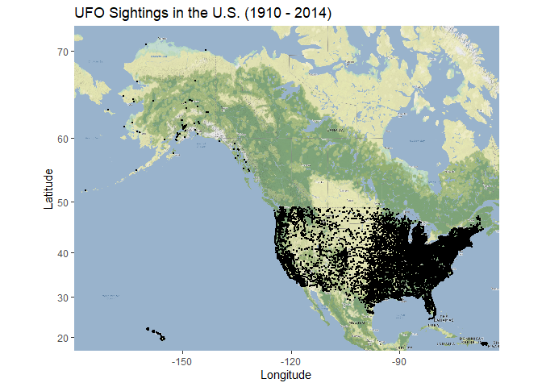
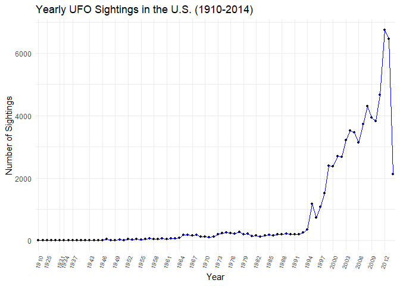
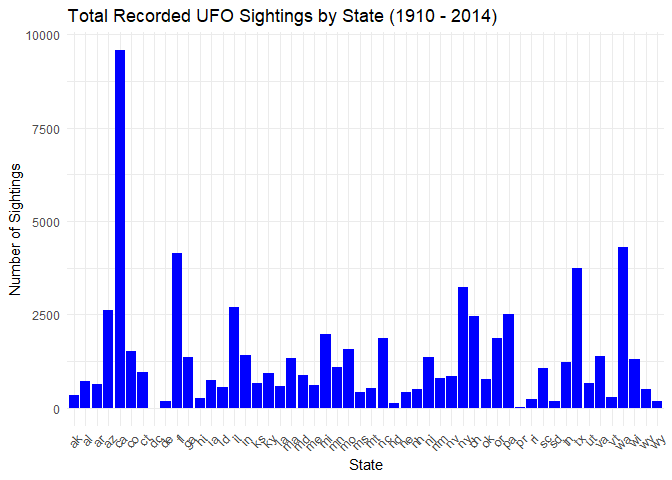

```r
#install.packages("paletteer")
```


```r
library("tidyverse")
```

```
## ── Attaching core tidyverse packages ──────────────────────── tidyverse 2.0.0 ──
## ✔ dplyr     1.1.4     ✔ readr     2.1.5
## ✔ forcats   1.0.0     ✔ stringr   1.5.1
## ✔ ggplot2   3.4.4     ✔ tibble    3.2.1
## ✔ lubridate 1.9.3     ✔ tidyr     1.3.0
## ✔ purrr     1.0.2     
## ── Conflicts ────────────────────────────────────────── tidyverse_conflicts() ──
## ✖ dplyr::filter() masks stats::filter()
## ✖ dplyr::lag()    masks stats::lag()
## ℹ Use the conflicted package (<http://conflicted.r-lib.org/>) to force all conflicts to become errors
```

```r
library("naniar")
library("janitor")
```

```
## 
## Attaching package: 'janitor'
## 
## The following objects are masked from 'package:stats':
## 
##     chisq.test, fisher.test
```

```r
library("ggmap")
```

```
## ℹ Google's Terms of Service: <https://mapsplatform.google.com>
##   Stadia Maps' Terms of Service: <https://stadiamaps.com/terms-of-service/>
##   OpenStreetMap's Tile Usage Policy: <https://operations.osmfoundation.org/policies/tiles/>
## ℹ Please cite ggmap if you use it! Use `citation("ggmap")` for details.
```

```r
library("dplyr")
library(RColorBrewer)
library(paletteer)
```

```
## Warning: package 'paletteer' was built under R version 4.3.3
```

Import data and fill the NA's 

```r
ufo <- readr::read_csv("ufo_data/complete.csv", na = c("", "unkown")) %>% clean_names
```

```
## Warning: One or more parsing issues, call `problems()` on your data frame for details,
## e.g.:
##   dat <- vroom(...)
##   problems(dat)
```

```
## Rows: 88875 Columns: 11
## ── Column specification ────────────────────────────────────────────────────────
## Delimiter: ","
## chr (10): datetime, city, state, country, shape, duration (hours/min), comme...
## dbl  (1): duration (seconds)
## 
## ℹ Use `spec()` to retrieve the full column specification for this data.
## ℹ Specify the column types or set `show_col_types = FALSE` to quiet this message.
```


```r
glimpse(ufo)
```

```
## Rows: 88,875
## Columns: 11
## $ datetime           <chr> "10/10/1949 20:30", "10/10/1949 21:00", "10/10/1955…
## $ city               <chr> "san marcos", "lackland afb", "chester (uk/england)…
## $ state              <chr> "tx", "tx", NA, "tx", "hi", "tn", NA, "ct", "al", "…
## $ country            <chr> "us", NA, "gb", "us", "us", "us", "gb", "us", "us",…
## $ shape              <chr> "cylinder", "light", "circle", "circle", "light", "…
## $ duration_seconds   <dbl> 2700, 7200, 20, 20, 900, 300, 180, 1200, 180, 120, …
## $ duration_hours_min <chr> "45 minutes", "1-2 hrs", "20 seconds", "1/2 hour", …
## $ comments           <chr> "This event took place in early fall around 1949-50…
## $ date_posted        <chr> "4/27/2004", "12/16/2005", "1/21/2008", "1/17/2004"…
## $ latitude           <chr> "29.8830556", "29.38421", "53.2", "28.9783333", "21…
## $ longitude          <chr> "-97.9411111", "-98.581082", "-2.916667", "-96.6458…
```
Remove unnecessary data, seperate dates, and filter out anything not in the US. 

```r
ufo2 <- ufo %>%
  separate(datetime, into = c("day", "month","year"), sep="/") %>%
  separate(year, into = c("year", "time"), sep = " ") %>%
  select(-duration_hours_min, -comments, -date_posted) %>%
  filter(country=="us")
ufo2
```

```
## # A tibble: 70,293 × 11
##    day   month year  time  city    state country shape duration_seconds latitude
##    <chr> <chr> <chr> <chr> <chr>   <chr> <chr>   <chr>            <dbl> <chr>   
##  1 10    10    1949  20:30 san ma… tx    us      cyli…             2700 29.8830…
##  2 10    10    1956  21:00 edna    tx    us      circ…               20 28.9783…
##  3 10    10    1960  20:00 kaneohe hi    us      light              900 21.4180…
##  4 10    10    1961  19:00 bristol tn    us      sphe…              300 36.5950…
##  5 10    10    1965  23:45 norwalk ct    us      disk              1200 41.1175…
##  6 10    10    1966  20:00 pell c… al    us      disk               180 33.5861…
##  7 10    10    1966  21:00 live o… fl    us      disk               120 30.2947…
##  8 10    10    1968  13:00 hawtho… ca    us      circ…              300 33.9163…
##  9 10    10    1968  19:00 brevard nc    us      fire…              180 35.2333…
## 10 10    10    1970  16:00 bellmo… ny    us      disk              1800 40.6686…
## # ℹ 70,283 more rows
## # ℹ 1 more variable: longitude <chr>
```
Loading API key

```r
register_stadiamaps("aff428bd-8ad7-4b69-8b6b-b34301483ba9", write = FALSE)
```

Converting lat and long to numeric

```r
ufo2$latitude <- as.numeric(ufo2$latitude)
ufo2$longitude <- as.numeric(ufo2$longitude)
```

Bounding for Map

```r
ufo2 %>% 
  select(latitude, longitude) %>% 
  summary()
```

```
##     latitude       longitude      
##  Min.   :17.97   Min.   :-176.66  
##  1st Qu.:34.11   1st Qu.:-114.98  
##  Median :38.96   Median : -90.05  
##  Mean   :38.35   Mean   : -95.70  
##  3rd Qu.:41.95   3rd Qu.: -81.03  
##  Max.   :70.64   Max.   : -65.83
```


```r
latitude <- c(17.97, 70.67)
longitude <- c(-176.66, -65.83)
alien_bbox <- make_bbox(longitude, latitude, f = 0.03)
```

Load Map from Stamen

```r
alien_map <-  get_stadiamap(alien_bbox, maptype = "stamen_terrain", zoom=5)
```

```
## ℹ © Stadia Maps © Stamen Design © OpenMapTiles © OpenStreetMap contributors.
```

```
## ℹ 99 tiles needed, this may take a while (try a smaller zoom?)
```

Final Map

```r
ggmap(alien_map) + 
  geom_point(data = ufo2, aes(longitude, latitude), size=0.1) +
  labs(x= "Longitude", y= "Latitude", title="UFO Sightings in the U.S")
```

<!-- -->
Plot of Sightings Over The Years

```r
names(ufo2)
```

```
##  [1] "day"              "month"            "year"             "time"            
##  [5] "city"             "state"            "country"          "shape"           
##  [9] "duration_seconds" "latitude"         "longitude"
```


```r
ufo2$year <- as.numeric(ufo2$year)
```
Table of Yearly Sightings in Desc Order

```r
ufo2 %>% 
  group_by(year) %>% 
  summarise(sightings = n()) %>% 
  arrange(desc(sightings))
```

```
## # A tibble: 84 × 2
##     year sightings
##    <dbl>     <int>
##  1  2012      6750
##  2  2013      6463
##  3  2011      4666
##  4  2008      4309
##  5  2009      3937
##  6  2010      3825
##  7  2007      3732
##  8  2004      3514
##  9  2005      3458
## 10  2003      3218
## # ℹ 74 more rows
```


```r
sightings_summary <- ufo2 %>%
  filter(!is.na(year)) %>% 
  group_by(year) %>% 
  summarise(sightings = n())
```

Final Plot
Feel free to color this however. Was also debating having it as a line plot. LMK


```r
ggplot(sightings_summary, aes(x = year, y = sightings, group = year, na.rm = T))+
  geom_col(position = "dodge", na.rm = T)+
  labs(title = "UFO Sightings Over the Years (1910-2014)",
       x= "Year",
       y = "Number of Sightings")+
  theme_minimal()
```

<!-- -->
THis plot is the same as above but in a line idk if this is better or not

```r
ggplot(sightings_summary, aes(x = year, y = sightings))+
  geom_line()+
  labs(title = "UFO Sightings Over the Years (1910-2014)",
       x= "Year",
       y = "Number of Sightings")+
  theme_minimal()
```

<!-- -->

Plot of Timings Per State
Feel free to change the plot type

```r
ufo2_avg_time <- ufo2 %>% 
  filter(!is.na(duration_seconds & duration_seconds != 0)) %>% 
  group_by(state) %>% 
  summarise(avg_secs = mean(duration_seconds))
```


```r
ufo2_avg_time %>%
  ggplot(aes(x = state, y = avg_secs))+
  geom_col()+
  labs(title = "Average Duration of UFO Sightings by State",
       x = "State",
       y= "Duration (Seconds)")+
  theme(axis.text.x = element_text(angle = 45, hjust = 1))
```

<!-- -->
^^ THis plot is a work in progress
